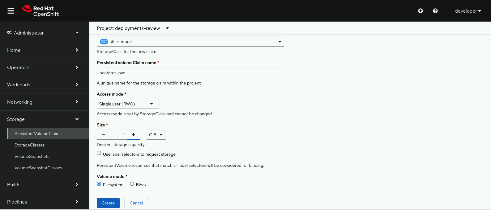
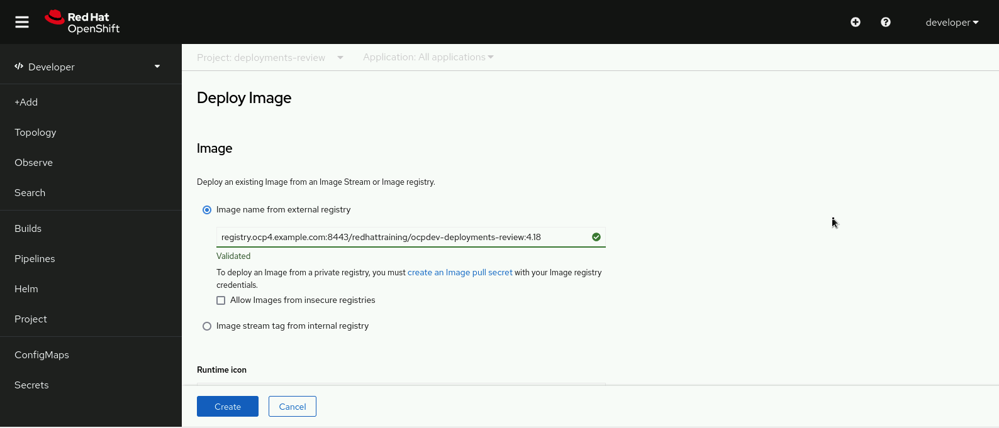
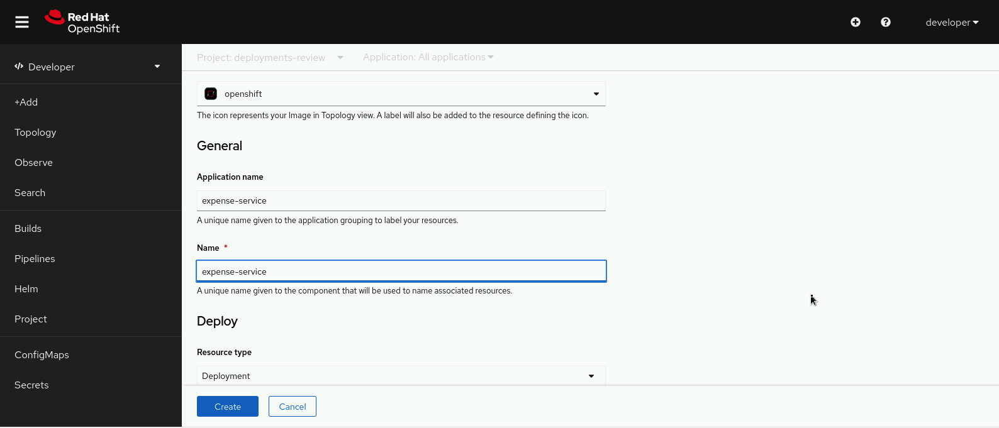
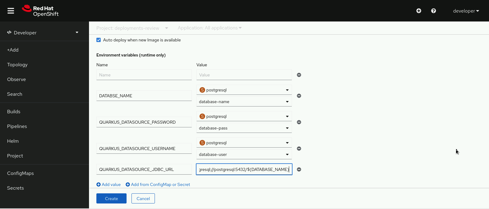
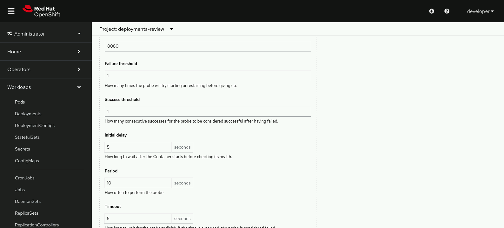

# Building and Deploying Cloud-native Applications

## Outcomes
- Deploy applications to Red Hat OpenShift.
- Configure persistence for deployments.
- Inject configuration maps and secrets into deployments.
- Configure liveness and readiness checks.

## Instructions
### 1. postgresql application
1. Create a PersistentVolumeClaim object called postgres-pvc that uses the nfs-storage storage class. Set the storage size to 1Gi and use the ReadWriteOnce access mode.
2. Configure a persistent volume for the provided PostgreSQL deployment. Mount the postgres-pvc persistent volume claim in the /var/lib/pgsql/data path.

### 2. expense-service application
Deploy the expense-service application. Use the following information to deploy the application:

| Parameter                 | Value |
| ---	                    | --- |
| Application Name	        | expense-service |
| Container Image           | registry.ocp4.example.com:8443/redhattraining/ocpdev-deployments-review:4.18 |
| Application URL	        | http://expense-service-deployments-review.apps.ocp4.example.com|

#### Environment Variables
Use the secret called postgresql to inject environment variables into the expense-service deployment.
| Variable Name                     | Value |
| ---	                            | --- |
| QUARKUS_DATASOURCE_USERNAME	    | PostgreSQL connection user |
| QUARKUS_DATASOURCE_PASSWORD	    | PostgreSQL connection user |
| QUARKUS_DATASOURCE_JDBC_URL	    | JDBC URL in the jdbc:postgresql://postgresql:5432/DATABASE format |

### 3. Health Probes
Configure liveness and readiness probes for the application deployment. Use the /q/health/live endpoint for liveness probe, and the /q/health/ready endpoint for readiness probe.

Both probes should succeed after one successful call and fail after one unsuccessful call. They should also set the timeout to 1 second, use 5 seconds initial delay, and activate every 5 seconds.

Finally, both probes should use the 8080 port.


## Tasks & Solution
### Task 1: 
#### Create a PVC via the GUI


```bash
# via the CLI

# Create PVC
oc create pvc postgres-pvc \
  --storage-class=nfs-storage \
  --access-mode=ReadWriteOnce \
  --request=storage=1Gi

# Verify that the persistent volume claim is bound and ready to be used.
oc describe pvc/postgres-pvc
```
Configure a persistent volume for the provided PostgreSQL deployment. Mount the postgres-pvc persistent volume claim in the /var/lib/pgsql/data path.
```bash
# Verify that the PostgreSQL deployment currently has no volumes.
oc get deploy/postgresql -o yaml | grep volumes:

# Add a postgresql-data volume that uses the postgres-pvc persistent volume claim. Use the oc set command:
oc set volume deploy/postgresql \
--add --name=postgresql-data -t pvc \
--claim-name=postgres-pvc \
--mount-path /var/lib/pgsql/data
```

### Task 2: 

#### Create the expense-service app via the GUI




```bash
[student@workstation expense-service] ls oc get route
NAME                HOST/PORT
expense-service     expense-service-deployments-review.apps.ocp4.example.com

[student@workstation expense-service] curl-s http://expense-service-deployments-review.apps.ocp4.example.com/expenses | jq
"amount": 15.00,
"associateld": 1,
"name": "Phone",
"paymentMethod":
"CASH",
},
"id": 10,
"amount": 15.00,
"associateld": 2,
"name": "Phone",
"paymentMethod": "CASH",
"uuid": "9547e9a2-e642-4816-8db0-6ae73277618b"
},
"i d": 7,
"amount": 15.00,
"associateId": 2,
"name": "Printer Cartridges",
"paymentMethod": "CREDIT_CARD",
"uuid": "659c04ef-c8c7-4a4f-8705-5bb4f955bca0"
}
```

#### Create the expense-service app via the CLI
```bash
# Deploy the expense-service application.
oc new-app --name=expense-service --image=registry.ocp4.example.com:8443/redhattraining/ocpdev-deployments-review:4.18

# Set the environment variables to use the postgresql secret values.
oc set env deploy/expense-service --from=secret/postgresql

# Edit the deployment and modify the environment variable names to fit the application requirements. Save the changes and exit your editor to apply the changes.
[student@workstation ~]$ oc edit deploy/expense-service
...output omitted...
spec:
  containers:
  - env:
    - name: DATABASE_NAME
      valueFrom:
        secretKeyRef:
          key: database-name
          name: postgresql
    - name: QUARKUS_DATASOURCE_PASSWORD
      valueFrom:
        secretKeyRef:
          key: database-pass
          name: postgresql
    - name: QUARKUS_DATASOURCE_USERNAME
      valueFrom:
        secretKeyRef:
          key: database-user
          name: postgresql
...output omitted...

# Use the DATABASE_NAME environment variable to construct the QUARKUS_DATASOURCE_JDBC_URL environment variable.
oc set env deploy/expense-service QUARKUS_DATASOURCE_JDBC_URL='jdbc:postgresql://postgresql:5432/$(DATABASE_NAME)'

# Verify the environment variable configuration.
oc describe deploy/expense-service | grep -A4 Environment
Environment:
  DATABASE_NAME:                <set to the key 'database-name' in secret 'postgresql'>      Optional: false
  QUARKUS_DATASOURCE_PASSWORD:  <set to the key 'database-password' in secret 'postgresql'>  Optional: false
  QUARKUS_DATASOURCE_USERNAME:  <set to the key 'database-user' in secret 'postgresql'>      Optional: false
  QUARKUS_DATASOURCE_JDBC_URL:  jdbc:postgresql://postgresql:5432/$(DATABASE_NAME)
```

### Task 3:
#### Create health probes via the GUI


#### Create health probes via the CLI
```bash
# Configure the liveness probe.
oc set probe deploy/expense-service \
--liveness --get-url=http://:8080/q/health/live \
--timeout-seconds=1 \
--initial-delay-seconds=5 \
--success-threshold=1 \
--failure-threshold=1 \
--period-seconds=5

# Configure the readiness probe.
oc set probe deploy/expense-service \
--readiness --get-url=http://:8080/q/health/ready \
--timeout-seconds=1 \
--initial-delay-seconds=5 \
--success-threshold=1 \
--failure-threshold=1 \
--period-seconds=5

# Verify probes in the deployment.
oc describe deploy/expense-service | grep "http-get"

```

